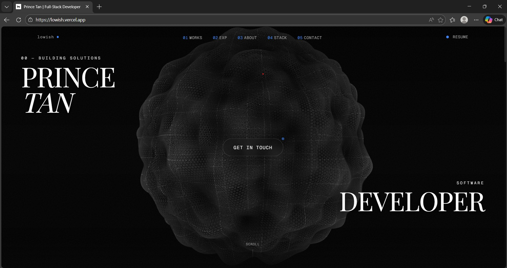

# React Portfolio

A modern portfolio website built with Next.js, React, TypeScript, and Tailwind CSS.

## Preview



## Prerequisites

- Node.js 18+
- npm 9+

## Installation

1. Clone the repository.
2. Move into the project directory.
3. Install dependencies.
4. Start the development server.

```bash
git clone <your-repo-url>
cd react-portfolio
npm install
npm run dev
```

The app will be available at `http://localhost:3000`.

## Available Scripts

- `npm run dev` - Start the development server.
- `npm run build` - Build the app for production.
- `npm run start` - Start the production server on port 3001.
- `npm run lint` - Run ESLint checks.

## Production Run

```bash
npm run build
npm run start
```
